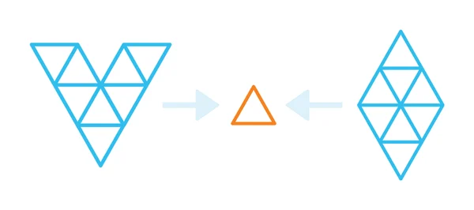

# Open Class: Learn the Essential Foundations

**LEARNING OUTLINE**
* Computational Thinking
* Programming Basic
* Git & Github
---
### APA ITU COMPUTATIONAL THINKING?
> Sederhananya, **Computational Thinking** adalah kemampuan untuk memecahkan masalah kompleks dengan menggunakan prinsip-prinsip pemrograman dan logika komputasi.


**Terdapat 4 landasan utama pada konsep Computational Thinking**
1. Decomposition (Dekomposisi)
2. Pattern recognition (Pengenalan Pola)
3. Abstraction (Abstraksi)
4. Algorithms (Algoritma)

### A. Decomposition (Dekomposisi)
> Proses mengurai masalah yang kompleks menjadi bagian-bagian kecil sehingga lebih mudah untuk ditangani.


**Analogi Dekomposisi Ketika Menyeduh Kopi**
* **Mempersiapkan Air Panas:** Memanaskan air dengan suhu yang tepat
* Membuka kemasan kopi
* Menempatkan kopi sachet dalam cangkir
* **Menuangkan Air Panas:** Menuangkan air panas ke dalam cangkir berisi kopi sachet
* **Mengaduk Kopi (Opsional):** Aduk kopi agar merata
* Hidangkan kopi

**Contoh Dekomposisi Dalam Pemrograman Python:**
```python
# Langkah 1: Mempersiapkan Air Panas
def mempersiapkan_air():
    print("Panaskan air hingga mendidih.")

# Langkah 2: Memilih Kopi Sachet
def memilih_kopi():
    print("Pilih sachet kopi favorit Anda.")

# Langkah 3: Membuka Sachet
def membuka_sachet():
    print("Buka kemasan sachet kopi dengan hati-hati.")

# Langkah 4: Menyeduh Kopi
def menyeduh_kopi():
    print("Masukkan sachet kopi ke dalam cangkir.")
    print("Tuangkan air panas ke dalam cangkir dengan sachet kopi.")
    print("Aduk perlahan untuk memastikan kopi tercampur dengan baik.")

# Langkah 5: Menikmati Kopi
def menikmati_kopi():
    print("Angkat sachet kopi dan nikmati secangkir kopi yang nikmat.")

# Implementasi Seluruh Proses
def menyeduh_kopi_sachet():
    mempersiapkan_air()
    memilih_kopi()
    membuka_sachet()
    menyeduh_kopi()
    menikmati_kopi()

# Panggil Fungsi Utama
menyeduh_kopi_sachet()
```
> Pada contoh program di atas, setiap langkah dipecah ke dalam beberapa prosedur sehingga lebih memudahkan untuk diolah, diproses, dan dipahami. Coba bayangkan kalau kamu menyatukan seluruh proses di atas tanpa memecah setiap bagiannya, maka tentu saja program akan terlihat terlalu kompleks dan sulit untuk dipahami.

---

### B. Pattern recognition (Pengenalan Pola)
> Mencari dan menganalisa persamaan atau pola yang terdapat di dalam suatu permasalahan.

**Perhatikan Gambar Berikut!**

>Apa yang berhasil kamu tangkap dari gambar tersebut?

**Analogi: Pola pada Deret Angka**

Bayangkan kamu memiliki deret angka berikut: `2, 4, 6, 8, 10.`

Dalam deret ini, kita bisa mengenali bahwa setiap angka berikutnya merupakan angka genap dan hasil penambahan 2 dari angka sebelumnya (kelipatan 2).
Misal, `2 + 2 = 4`, `4 + 2 = 6`, `6 + 2 = 8` dan seterusnya.

> Dengan penerapan **pattern recognition**, kita bisa dengan cepat mengidentifikasi hubungan atau aturan tertentu di antara elemen-elemen suatu set atau deret data (berlaku juga untuk permasalahan lain secara luas). Dengan begitu, kita bisa dengan lebih mudah untuk memahami dan memprediksi apa yang akan terjadi selanjutnya.

**Contoh Pattern Recognition Dalam Pemrograman Python**
```python
# Fungsi untuk Mengenali Pola pada Deret Angka
def mengenali_pola(deret):
    pola = deret[1] - deret[0]  # Menghitung pola dari selisih elemen pertama dan kedua
    for i in range(1, len(deret)-1):
        if deret[i+1] - deret[i] != pola:
            return None  # Jika selisih antar elemen tidak sama, maka tidak ada pola
    return pola

# Deret Angka
deret_angka = [2, 4, 6, 8, 10]

# Mengenali Pola pada Deret Angka
hasil_pola = mengenali_pola(deret_angka)

# Menampilkan Hasil
if hasil_pola is not None:
    print(f"Pola deret angka adalah penambahan {hasil_pola}")
else:
    print("Tidak ada pola yang teridentifikasi dalam deret angka.")
```
**Bedah Program:**
1. Fungsi `mengenali_pola` akan menerima sebuah deret angka dan mencoba mengenali pola di antara elemen-elemennya.
2. Program akan memeriksa apakah selisih antar elemen berurutan adalah konstan. Jika iya, maka program akan mengembalikan pola penambahan tersebut.
3. Dalam contoh deret angka `[2, 4, 6, 8, 10]`, program akan mengenali pola sebagai penambahan 2.
4. Hasil dari pengenalan pola akan ditampilkan.
   
> Jika kamu ingin mencoba dengan deret angka lain, cukup ubah nilai pada variabel `deret_angka` sesuai keinginanmu. Misalnya, deret_angka = `[3, 6, 9, 12, 15]` akan menghasilkan pola penambahan 3.

---

### C. Abstraction (Abstraksi)
> Fokus pada informasi yang penting saja dan mengabaikan informasi lain yang tidak relevan



**Analogi: Pemilihan Playlist Musik**

Bayangkan kamu sedang menggunakan aplikasi musik seperti Spotify dan ingin memilih playlist untuk suasana hati tertentu, misalnya "Santai". Ketika kamu memilih playlist "Santai", kamu sebenarnya tidak perlu tahu setiap lagu yang ada di dalamnya atau bagaimana dibuatnya. Kamu hanya perlu tahu bahwa playlist ini cocok untuk suasana hati santai.

Nah, dalam kasus ini kamu telah melakukan abstraksi terhadap kumpulan lagu dalam playlist. Kamu tidak perlu sampai memikirkan detail dari setiap lagu, tetapi cukup menggunakan abstraksi "Playlist Santai" untuk mencapai tujuanmu **(Mendengarkan musik santai)**.

> Dalam Computational Thinking, **abstraction** memungkinkan kita untuk fokus pada informasi yang penting saja dan mengabaikan detail yang tidak relevan. Seperti dalam contoh ini, kamu fokus pada tujuan akhir (mendengarkan musik santai) tanpa harus tahu semua lagu di dalam playlist tersebut.

**Contoh Abstraction Dalam Pemrograman Python:**
```python
# Daftar Playlist Musik
playlist_santai = ["Lagu Santai 1", "Lagu Santai 2", "Lagu Santai 3", "Lagu Santai 4"]
playlist_energik = ["Lagu Energi 1", "Lagu Energi 2", "Lagu Energi 3", "Lagu Energi 4"]

# Fungsi untuk Memilih Playlist
def pilih_playlist(suasana_hati):
    if suasana_hati == "santai":
        return playlist_santai
    elif suasana_hati == "energik":
        return playlist_energik
    else:
        return []

# Meminta Input Suasana Hati dari Pengguna
suasana_hati = input("Masukkan suasana hati Anda (santai / energik): ")

# Memilih Playlist Sesuai Suasana Hati
playlist_terpilih = pilih_playlist(suasana_hati)

# Menampilkan Playlist Terpilih
if playlist_terpilih:
    print(f"Playlist {suasana_hati}:")
    for lagu in playlist_terpilih:
        print(f"- {lagu}")
else:
    print("Playlist tidak ditemukan.")
```
**Bedah Program:**
1. Program memiliki dua daftar playlist: `playlist_santai` dan `playlist_energik`.
2. Fungsi `pilih_playlist` menerima input `suasana_hati` dan mengembalikan playlist sesuai dengan suasana hati yang diminta.
3. Pengguna diminta untuk memasukkan suasana hati mereka (santai atau energik).
4. Program memilih playlist berdasarkan input pengguna dan menampilkannya.
5. Misalnya, jika pengguna memasukkan "santai", program akan menampilkan playlist santai. Jika pengguna memasukkan sesuatu selain "santai" atau "energik", program akan memberikan pesan bahwa playlist tidak ditemukan.

---

### D. Algorithms (Algoritma)
> Urutan langkah-langkah sistematis, logis dan efektif untuk menyelesaikan suatu permasalahan.
