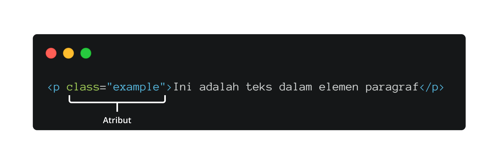

# GETTING STARTED WITH HTML5 AND CSS3

**LEARNING OUTLINE**
* Membuat Website dengan HTML dan CSS
* Membuat Responsive Website dengan Media Query
---
### APA ITU HTML?
> HTML adalah sebuah bahasa singkatan dari HyperText Markup Language dan ini adalah bahasa markah standar untuk peramban internet.
> HTML juga bisa disebut sebagai sebuah kerangka dari website.

**Mari kita bahas lebih dalam apa itu HTML!**

### Kerangka HTML
> Jika kalian menggunakan software VSCode maka untuk membuat sebuah kerangka HTML anda perlu membuat terlebih dahulu sebuah file dengan format HTML. Jika sudah membuat sebuah file HTML maka di dalam code editor kalian tinggal mengetik tanda seru (!) lalu tekan Tab dikeyboard kalian, maka sebuah kerangka HTML akan terbuat. Kira-kira seperti inilah kerangka HTML :
```html
<!DOCTYPE html>
<html lang="en">
<head>
  <meta charset="UTF-8">
  <meta name="viewport" content="width=device-width, initial-scale=1.0">
  <title>Document</title>
</head>
<body>
  
</body>
</html>
```
Jika kalian perhatikan didalam kerangka HTML ada beberapa tag yang tersedia. Tag-tag tersebut diantara lain : ```<html></html>, <head></head>, <title></title>, dan <body></body>.```
> Pada tag HTML terdapat tag pembuka dan tag penutup. Akan saya jelaskan setelah ini.

### Mari kita pelajari element dari HMTL
Sudah dijelaskan bahwa pada elemen HTML terdapat sebuah tag pembuka dan juga tag penutup.

**Kita ambil contoh menggunakan tag ```<p>``` atau paragraf.**

> Jika kalian perhatikan gambar diatas tag pembuka ditandai dengan huruf p dan diberikan kurung siku <> dan tag penutup ditandai dengan huruf p dan berikan kurung siku dengan garis miring didalamnya </>. Konten dari sebuah elemen adalah teks yang ada dalam elemen tersebut. Elemen adalah keseluruhan dari tag dan isi kontennya.

### Atribut Pada Element HTML
Dalam membuat elemen HTML, ada satu hal yang dapat dilakukan, yaitu memberi atribut. Atribut dapat memberi informasi-informasi tambahan untuk elemen HTML. Informasi ini tidak akan tampil dalam halaman web, tetapi ia dapat menentukan perilaku elemen biasanya.


> Pada gambar di atas, kita memiliki atribut class. Secara singkat, atribut ini merupakan sebuah nama identitas yang digunakan untuk menargetkan elemen dengan kode styling. Untuk pembahasan styling akan dicakup setelah HTML. Selain atribut class juga ada atribut id dan juga src dan masih banyak lagi.

### APA ITU CSS?
> CSS sendiri adalah singkatan dari Cascading Style Sheets, ini adalah sebuah komponen untuk membuat website kita lebih terstruktur dan seragam.
---
